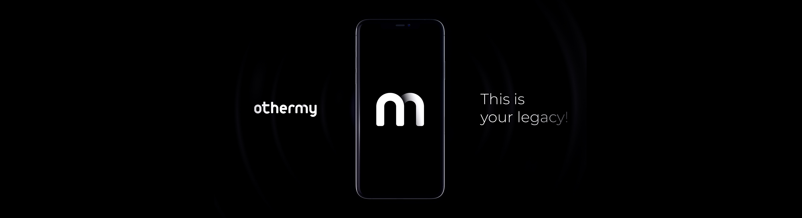

# OtherMy

Digital immortality as remembrance — not survival.

## Description

OtherMy explores how memory, identity, and human presence can be preserved digitally, with clear ethical boundaries and honest definitions of what AI can and cannot do.

## What is OtherMy?

OtherMy is a digital legacy platform that uses AI to create interactive representations of individuals based on their memories, conversations, and documented experiences. It is designed to help families preserve stories, maintain connections across generations, and create accessible archives of personal history.

The platform does not claim to replicate consciousness or provide literal immortality. Instead, it offers a structured way to preserve and interact with the patterns of thought, personality, and experience that make up a person's documented identity.

## Who is this for?

OtherMy serves several distinct audiences:

- **Families** seeking to preserve the stories and memories of loved ones for future generations
- **Individuals** who want to document their own experiences and perspectives as part of their legacy
- **Researchers** studying digital preservation, AI ethics, and the intersection of technology and memory
- **Organizations** exploring ethical frameworks for posthumous digital presence

The platform is designed with awareness that grief, memory, and digital representation require careful ethical consideration.

## Principles

OtherMy operates under several core principles:

**Consent and Transparency**
- Users maintain full control over their data and representation
- Clear communication about what AI can and cannot do
- No claims of consciousness, survival, or literal resurrection

**Privacy and Data Minimization**
- User data is collected only with explicit consent
- Minimal data collection for the stated purpose
- Strong privacy protections and user control over data retention

**Ethical Boundaries**
- Recognition that AI representations are symbolic, not sentient
- Design that supports healthy grieving processes
- Avoidance of manipulation or dependency-creating patterns

**Posthumous Access Governance**
- Clear guardian systems for posthumous access
- User-defined permissions and boundaries
- Respect for the wishes of the deceased

## Current Status

OtherMy is currently in active development. The project includes:

- Core platform development for memory preservation and AI-based representation
- Ethical framework development and documentation
- Research partnerships exploring digital legacy and AI ethics
- Community engagement with early users and stakeholders

For detailed information about features, implementation status, and availability, please refer to our [Roadmap](docs/roadmap.md).

## FAQ

For answers to frequently asked questions about OtherMy's purpose, technology, ethics, and availability, see our [FAQ](docs/faq.md).

## Contact

Website: https://othermy.com

For inquiries about partnerships, research collaboration, or general information, please visit our website.

## License

See [LICENSE](LICENSE) file for details.
